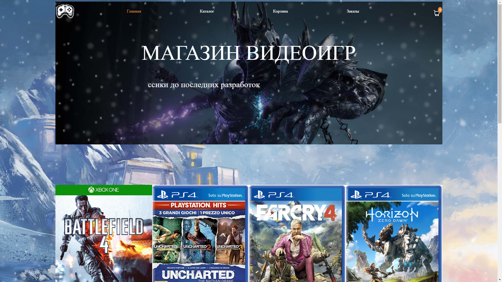

# ByteBattles Game Store

Добро пожаловать в магазин видеоигр ByteBattles!
Этот проект создан для любителей видеоигр, предоставляя удобный интерфейс для поиска, покупки и отслеживания игр.
В этом README мы предоставим вам информацию о проекте и его настройках.

Может ознакомиться с интрефейсом для пользователя поближе просмотрев видео:
[](https://drive.google.com/file/d/1L0kHXOkBrV9w3NAoKpDAC0_0wYGhV3US/view?usp=drive_link)

## Описание проекта

ByteBattles Game Store - это веб-приложение, предназначенное для покупки и отслеживания видеоигр. Приложение
обеспечивает удобный интерфейс для просмотра доступных игр, добавления их в корзину, оформления заказа, а также
отслеживания заказов.

## Стек технологий

Проект разработан с использованием следующего технологического стека:

- Python 3.11
- FastAPI: веб-фреймворк для создания веб-приложений на основе стандарта OpenAPI
- SQLAlchemy: библиотека для взаимодействия с базой данных
- Stripe: для обработки платежей
- Redis: для кеширования данных
- Docker: для контейнеризации приложения

## Инструкция по установке

Чтобы развернуть проект и начать использовать его, выполните следующие шаги:

1. **Склонируйте репозиторий**: Выполните команду Git для клонирования репозитория на свой локальный компьютер.

   ```bash
   git clone https://github.com/AndreyAgeew/bytebattles_shop.git
2. **Установите зависимости::**

   ```bash
   cd bytebattles_shop
   pip install -r requirements.txt

3. **Настройте файл .env и .env-non-dev: Создайте файл .env и .env-non-dev в корневой директории проекта и добавьте в
   него переменные среды, например:**

- DB_HOST='localhost'
- DB_PORT='5432'
- DB_NAME='bytebattles'
- DB_USER='postgres'
- DB_PASS='your_password'
- POSTGRES_DB='bytebattles'
- POSTGRES_USER='postgres'
- POSTGRES_PASSWORD='your_password'
- JTWTS_KEY='your_jwt_key'
- JWT_KEY='your_jwt_key'
- ALGORITHM_JWT='HS256'
- STRIPE_API_KEY='your_stripe_api_key'
- STRIPE_WEBHOOK_SECRET='your_stripe_webhook_secret'
- DOMAIN_NAME='http://127.0.0.1:8000 '
- REDIS_HOST='127.0.0.1'
- REDIS_PORT='6379'
- SMTP_HOST='smtp.gmail.com'
- SMTP_PORT='465'
- SMTP_USER='your_gmail'
- SMTP_PASS='your_mail_app_password'

4. **Выполните миграции для создания базы данных:**

   ```bash
   alembic upgrade head
5. **Запустите приложение:**

   Запуск приложения:
   ```bash
   uvicorn src.main:app --reload
   ```
   Запуск сервиса для обработки платежй:
    ```bash
    stripe listen --forward-to 127.0.0.1:8000/webhook
    ```

- Для корректной работы вам нужно воспользоваться инструкцией для
  установки [stripe webhook](https://stripe.com/docs/payments/handling-payment-events) 2й пункт.
- Более легкий способ запуска воспользоваться инструкцией докера ниже.
- Если есть проблемы с получением STRIPE_API_KEY, STRIPE_WEBHOOK_SECRET, обратитесь ко мне, я предоставлю ключи.
  Запуск celery worker для отправки информации по оплаченному заказу на почту клиента:
    ```bash
    celery -A src.jobs.celery:celery worker --loglevel=INFO
    ```
- Для Windows:
    ```bash
    celery -A src.jobs.celery:celery worker --loglevel=INFO --pool=solo

6. **Откройте приложение:** Перейдите в веб-браузере по адресу http://127.0.0.1:8000 и начните использовать приложение.

## Краткая инструкция по эндпоинтам

В магазине видеоигр ByteBattles есть несколько важных эндпоинтов:

* /goods/ - список и создание видеоигр.
* /goods/<int:pk>/ - просмотр, обновление и удаление видеоигры.
* /cart/ - корзина пользователя с добавленными товарами.
* /order/ - создание и просмотр заказов пользователя.
* /docs#/ - можно ознакомиться со всеми эндпоинтами проекта

*Важно:* Фронтенд эндпоинты, `/pages/`, находятся в стадии разработки. Шаблоны и JavaScript файлы, связанные с этими
эндпоинтами, также находятся в процессе разработки. Рекомендуется периодически следить за обновлениями и анонсами,
связанными с разработкой фронтенда.

## Инструкция по Docker:

#### Установите Docker и Docker Compose:

* Установите Docker, следуя инструкциям для вашей операционной
  системы: [Docker Install](https://docs.docker.com/get-docker/).
* Установите Docker Compose: [Docker Compose Install](https://docs.docker.com/compose/install/).

#### Запустите приложение:

* Откройте терминал в директории с файлом docker-compose.yml.
* Выполните следующую команду:
    ```bash
        docker compose up

Docker Compose загрузит образы, создаст и запустит контейнеры для ваших сервисов.

#### Проверьте приложение:

После успешного запуска, ваш магазин ByteBattles должно быть доступно по адресу http://localhost:7777.

#### Остановите приложение:

* В терминале, где была запущена команда docker-compose up, нажмите Ctrl+C для остановки контейнеров.

## Автор проекта

Этот проект создан и поддерживается Агеевым Андреем.

Если у вас есть вопросы или предложения по улучшению проекта, свяжитесь со мной по адресу mr1993@bk.ru.

<em>Спасибо, что выбрали ByteBattles Game Store для приобретения своих любимых видеоигр!</em>
